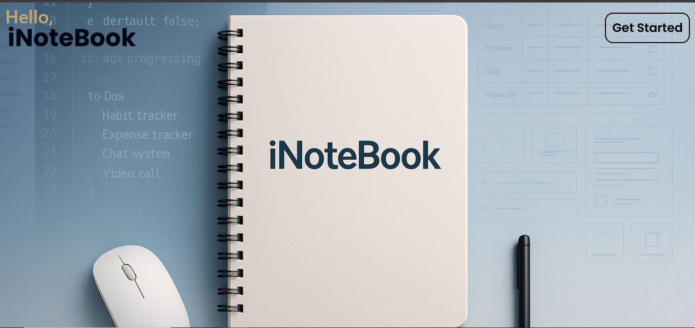
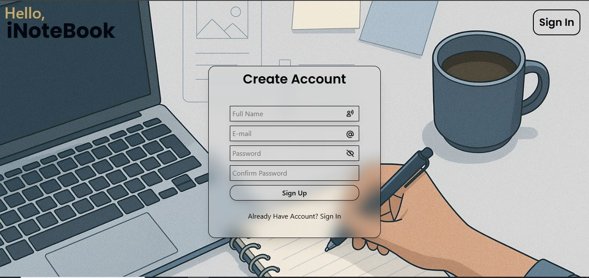
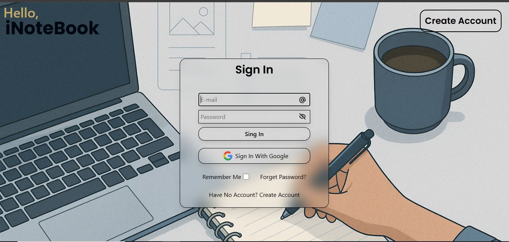
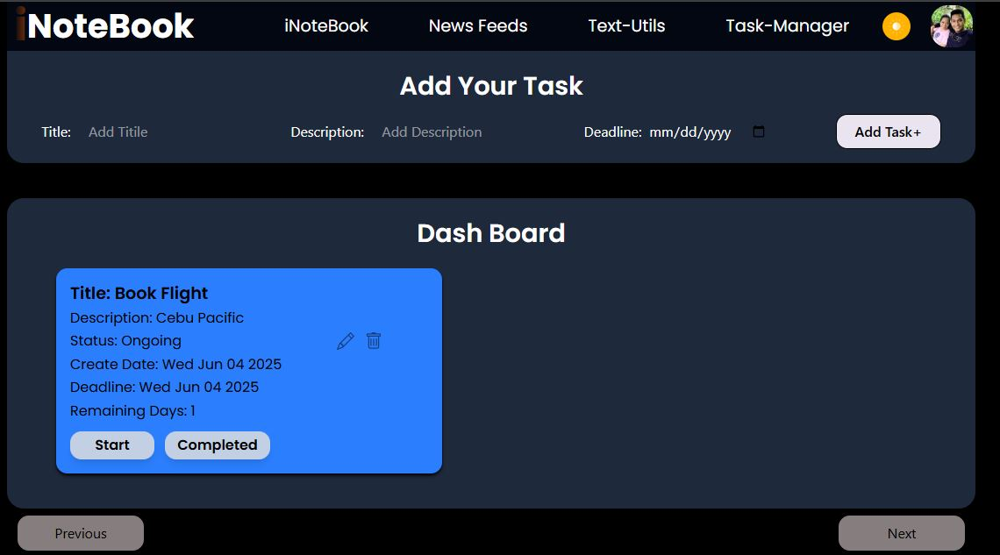

#iNoteBook App - Advanced Note Book App!
Fully Customized Combined of notebook, newspaper, text-utils, advanced task manager crated by react.js, node.js(express), mongoDB, tailwind CSS!

## Features(Auth)
- Signup
- Signin
- Email Verification
- Forget Password
- Reset Password
- Signin With Google
- Remember Password


## Features(Notebook)
- Add Board NoteBook
- CURD-(Create, Update, Read, Delete).
- Side Bar with profile info and photo.
- Display notebook at another page.
- Search your notebook with DB search.
- Fully Backend Controll.
- Dark Mood
## Features (Newspaper)
- Read Latest News.
- News By category.
- Page pagination Available (Previous/Next)
- Infinity Scroll Available.
- News source/author/time available.
- API Call News.
## Features (Text-Utils)
- Manage your text.
- Upparcase/Lowercase.
- Word count/ space remove.
- First word Capitalized.
- All Word Capitalized.
## Features (Advanced Task manager)
- Add Task with deadline.
- Start Task and this task will start countdown from starting date to deadline date.
- Background Color Change by status (pending: yellow, start: blue, complete: green, overdue: red)
- If the task overdeu its will give notification.
- if the task complete then will give success notification.
- CURD- option available.
- Page pagination Available (Previous/Next)
- Infinity Scroll Available.
- Fully Backend Controll.
- DataBased Saved.


## 🛠 Tech Stack
## Front-End
- React.js
- Tailwind Css
## Back-End
- Node.js(Express)
- MongoDB
- Cloudinary
- Multar
- Mongoose
- Resend
- Google Auth Verification
- Passport
## Protection
- express-rate-limit
- Xss-Clean
- Helmet
- Mongo-Sanitize
- Hpp
- CSRF
- Express-Slow-Down

## Live Demo
Not Available.

## ScreenShot






## Personal Note
Git commit history is not available for this project because it was developed on a low-end system.
Running Git or Git Extensions in VS Code significantly slowed down the editor, often causing it to hang.
As a result, version control was managed manually outside of VS Code for this project.


## 🚀 Run Locally

Clone the project:

```bash
git clone https://github.com/tousher101/iNoteBook.git
cd iNotebook
npm install
npm run dev


